# Agent Integration for Claude Code

## Problem Frame

Lore's knowledge base contains curated patterns and conventions that agents should follow when
writing code. Currently, agents only access these patterns when they (or the user) explicitly call
`search_patterns` via MCP. This pull model has a structural miss rate: agents skip consulting lore
on routine tasks where they're confident — precisely the tasks most likely to violate the user's
conventions. The result is code that is technically correct but wrong by the user's standards.

The integration needs to push relevant patterns to agents deterministically, without requiring the
agent to decide to search.

## Pattern Delivery Mechanisms

Five complementary mechanisms deliver patterns at different points in the agent lifecycle:

```mermaid
graph TB
    subgraph "SessionStart · deterministic · once"
        S1[Session begins] --> S2[Inject meta-instruction +<br/>pattern title index]
    end

    subgraph "PreToolUse Hook · deterministic · per-edit"
        A[Tool call: Edit / Write / Bash] --> B[Extract file path or command]
        B --> C["Search lore (hybrid)"]
        C --> D{Relevant AND<br/>not yet injected?}
        D -->|Yes| E[Inject imperative directives<br/>via additionalContext]
        D -->|No| F[Pass through silently]
    end

    subgraph "Error Hook · deterministic · on failure"
        G[Bash exits non-zero] --> H[Search lore with stderr]
        H --> I{Relevant patterns?}
        I -->|Yes| J[Inject recovery knowledge]
        I -->|No| K[No injection]
    end

    subgraph "PostCompact · deterministic · on compaction"
        P1[Context compacted] --> P2[Reset dedup tracker]
        P2 --> P3[Re-inject session priming]
    end

    subgraph "Auto-Invocable Skill · probabilistic · per-domain"
        L[New domain or explicit /lore:search] --> M[Comprehensive pattern search]
        M --> N[Full domain knowledge surfaced]
    end
```

| Mechanism            | Trigger                     | Determinism   | Granularity                   | Purpose                            |
| -------------------- | --------------------------- | ------------- | ----------------------------- | ---------------------------------- |
| SessionStart hook    | Session begins              | Deterministic | Meta + titles                 | Prime Claude to respect injections |
| PreToolUse hook      | Every Edit/Write/Bash       | Deterministic | Chunk (most relevant section) | Targeted per-edit injection        |
| Error hook           | Bash non-zero exit          | Deterministic | Chunk                         | Recovery from known gotchas        |
| PostCompact hook     | Context compaction          | Deterministic | Reset                         | Restore dedup + re-prime session   |
| Auto-invocable skill | Domain entry or user invoke | Probabilistic | Full domain                   | Comprehensive coverage             |

## Requirements

**Validation Spike**

- R1. Before building the full plugin, validate with a minimal prototype hook that PreToolUse
  `additionalContext` injection measurably influences Claude's code output. A single hand-written
  hook injecting a known pattern, followed by a coding task, confirms or falsifies the core premise.

**Plugin Packaging**

- R2. Ship as a Claude Code plugin containing hooks, an auto-invocable skill, and MCP server
  configuration
- R3. Zero configuration when `lore` is on PATH and patterns are ingested — plugin works out of the
  box
- R4. Plugin must be installable from a local directory during development (`claude --plugin-dir`)

**Pattern Injection (PreToolUse Hook)**

- R5. A PreToolUse hook fires on Edit, Write, and Bash tool calls
- R6. The hook builds a search query from multiple signals available in the hook input: file path
  and code content for Edit/Write, command text and description for Bash (description is reliably
  present but not schema-guaranteed — fall back to command text), and optionally the last user
  message from the transcript (via `transcript_path`) for intent signal. The hook should also skip
  injection for read-only subagents (e.g., Explore, Plan) using `agent_type`.
- R7. The hook calls `lore search` with the enriched query using hybrid search (FTS + semantic)
- R8. Results above the relevance threshold are formatted as imperative directives (e.g., "REQUIRED
  CONVENTIONS — Follow these rules:") and returned as `additionalContext`
- R9. Injection is at chunk level — the most relevant sections of a pattern document, not the full
  document body
- R10. Session-level deduplication prevents re-injecting patterns already delivered in the current
  session
- R11. When no relevant patterns are found, the hook injects nothing

**Session Priming (SessionStart Hook)**

- R12. A SessionStart command hook injects a meta-instruction that primes Claude to treat subsequent
  PreToolUse injections as binding constraints, plus a compact auto-generated index of all available
  pattern titles so Claude is aware of what the knowledge base covers
- R13. A PostCompact command hook resets the session dedup tracker so patterns lost to context
  compaction can be re-injected by subsequent PreToolUse calls

**Comprehensive Lookup (Skill)**

- R14. An auto-invocable skill searches lore for all patterns relevant to a domain or task
- R15. The skill is also user-invocable for explicit pattern lookup
- R16. The skill complements the hook: the hook provides targeted per-edit chunks, the skill
  provides comprehensive domain coverage when entering a new area

**Error Recovery (Error Hook)**

- R17. An error hook (PostToolUse on Bash) fires when commands fail (non-zero exit code)
- R18. The hook searches lore using the error output (stderr) as the query
- R19. If relevant patterns are found, they are returned as `additionalContext` to help the agent
  recover

**Lore CLI Enhancements**

- R20. A hook-friendly output format: concise imperative directives suitable for `additionalContext`
  injection, targeting ~50-100 tokens per pattern chunk
- R21. The format strips explanatory prose and retains only actionable rules
- R22. Expose `--top-k` as a CLI flag for `lore search`

**Testing Infrastructure (CI — blocking)**

- R23. Layer 1 — Hook unit tests: deterministic tests of the hook script's stdin-to-stdout pipeline,
  runnable in CI (GitHub Actions)
- R24. Layer 2 — Search relevance regression tests: given file-context queries, assert correct
  patterns surface above threshold, runnable in CI

**Testing Infrastructure (Fast-Follow — manual)**

- R25. Layer 3 — Compliance evaluation skill: LLM-based tool that audits a file against injected
  patterns and produces a structured compliance report
- R26. Layer 4 — End-to-end scenario harness: runs Claude with the plugin on defined task scenarios,
  evaluates compliance across multiple runs

## Success Criteria

- Validation spike (R1) confirms `additionalContext` measurably changes agent code output before
  full implementation proceeds
- PreToolUse hook fires reliably on every Edit/Write/Bash call and injects relevant patterns when
  they exist
- Irrelevant tool calls (files in domains without patterns) produce zero injection (precision)
- An agent writing code in a pattern-covered domain demonstrably follows those patterns more
  consistently than without the integration (compliance)
- Hook latency remains under 200ms p95 (validated: 117ms p95 on Linux Ryzen 5, 19ms p95 on Mac
  Studio)
- Context window growth from injections is bounded by session deduplication
- Test layers 1-2 run green in CI

## Scope Boundaries

- Claude Code only — no multi-agent support in this iteration
- No domain map configuration — always-search approach; optional domain map deferred
- No PostToolUse verification of pattern compliance — deferred pending real compliance data from v1
- No per-pattern severity or criticality metadata
- No pattern authoring guidance or tooling
- `lore` must be on PATH — installation and distribution is a separate concern
- Plugin marketplace distribution is out of scope — local directory install only
- Layers 3-4 (compliance skill, e2e harness) are fast-follow, not blocking for initial delivery

## Key Decisions

- **Always-search over domain map**: Hook searches on every relevant tool call rather than requiring
  user-curated mappings. Validated by search quality (0.95+ relevance on matching queries, zero
  results on irrelevant queries) and latency (94ms mean Linux, 16ms mean Mac). Domain map remains a
  future optional power-user refinement.
- **Hybrid search in hooks**: Semantic search included despite initial latency concerns. Benchmarks
  validated overhead is minimal (p95 under 120ms on commodity hardware).
- **Imperative injection format**: Patterns injected as directives ("REQUIRED — Follow these
  rules:") not information ("Here are some conventions:"). Expected to increase compliance without
  extra token cost.
- **Chunk-level injection, comprehensive guides via skill**: Hook injects per-edit relevant chunks.
  The auto-invocable skill provides full domain coverage for new areas. Session dedup ensures
  progressive coverage across multiple edits.
- **Defer PostToolUse verification**: Ship PreToolUse injection first. Gather compliance data. Add
  verification layer only if data shows gaps. Avoids per-pattern severity metadata burden on
  authors.
- **Session dedup over injection flooding**: Track injected chunk IDs per session. Prevents context
  window bloat from repeated patterns across edits in the same domain.
- **Contingency for weak `additionalContext` compliance**: If the spike (R1) shows that
  `additionalContext` is visible but insufficiently followed, the fallback is deny-first-touch: the
  PreToolUse hook denies the first edit per domain per session with patterns as the deny reason,
  forcing Claude to retry with patterns in context. Same hook mechanics, one exit-code change. Both
  levels validated by the spike.
- **Lore on PATH as prerequisite**: Plugin assumes `lore` binary is available. Installation story is
  a separate workstream.

## Dependencies / Assumptions

- Lore is installed and on PATH with patterns ingested
- Ollama is running for hybrid search (graceful degradation to FTS-only already implemented)
- Claude Code plugin system is stable (validated against March 2026 documentation)
- `additionalContext` returned by PreToolUse hooks is visible to Claude and influences subsequent
  tool execution — this is the load-bearing assumption validated by R1 before full implementation
- Pattern documents use headings to structure content so chunk-level search returns meaningful
  sections
- A "session" is one Claude Code conversation window (from start or resume to exit). Session dedup
  state resets when a new session begins.

## Outstanding Questions

### Deferred to Planning

- [Affects R6][Technical] Query construction strategy: which signals produce the best search
  results? Candidates ranked by expected quality: Bash description (natural language, free),
  transcript tail (user intent, IO cost), code content (rich but needs term extraction), file path
  (reliable but coarse). Validate empirically during spike — raw signals may outperform engineered
  extraction.
- [Affects R10][Technical] Session dedup mechanism — temp file keyed by session_id from hook input?
  Chunk ID tracking? Storage format and cleanup.
- [Affects R12][Technical] How does the SessionStart hook generate the pattern index? Call
  `lore search` with a broad query, or a dedicated `lore list` subcommand that returns all pattern
  titles?
- [Affects R13][Technical] PostCompact dedup reset — full reset or selective? Should it re-inject
  the SessionStart meta-instruction as well?
- [Affects R20][Technical] Hook-friendly output format shape — new CLI flag (`--format context`)?
  Dedicated subcommand (`lore hook`)? Or a formatting layer in the hook script itself?
- [Affects R23][Technical] Test framework choice for hook unit tests — shell (bats), Rust
  integration tests invoking the hook script, or both.
- [Affects R2][Needs research] Plugin manifest structure, component layout, and MCP server wiring
  within the plugin.

## Next Steps

All questions are deferred to planning.

-> `/ce:plan` for structured implementation planning
