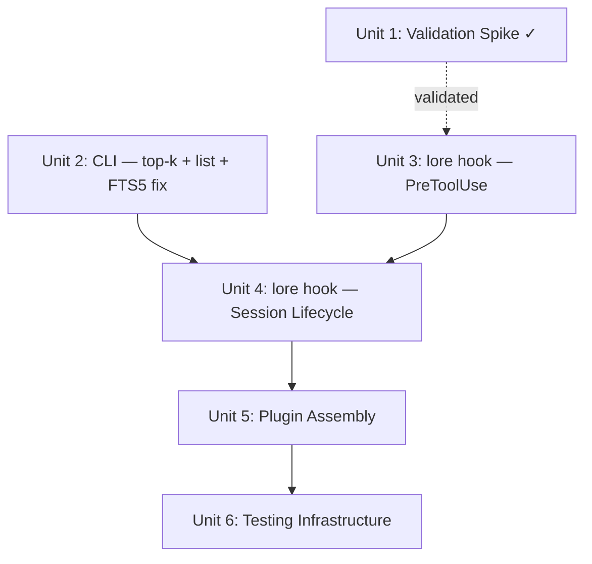

# Agent Integration — Claude Code Plugin

## Overview

Ship a Claude Code plugin that deterministically pushes lore patterns to agents via lifecycle hooks.
Five mechanisms cover the full session lifecycle: SessionStart priming, PreToolUse injection, error
recovery, PostCompact restoration, and an auto-invocable skill. A validation spike gates the full
build on proving that `additionalContext` actually influences agent behavior.

## Problem Frame

Agents skip consulting lore on routine tasks where they are confident. The pull model (MCP tools
alone) has a structural miss rate for "confident but wrong by taste" cases. The integration pushes
patterns deterministically via PreToolUse hooks, bypassing the agent's decision to search. (see
origin: `docs/brainstorms/2026-04-01-agent-integration-claude-code-requirements.md`)

## Requirements Trace

- R1. Validation spike — confirm `additionalContext` premise before full build
- R2–R4. Plugin packaging — zero-config, local-dir installable
- R5–R11. PreToolUse hook — always-search, hybrid, imperative chunk injection, dedup
- R12–R13. SessionStart priming + PostCompact reset
- R14–R16. Auto-invocable skill
- R17–R19. Error hook
- R20–R21. Imperative formatting (built into `lore hook`, not a separate CLI flag)
- R22. `--top-k` CLI flag on `lore search`
- R23–R24. CI testing (hook unit tests, search relevance regression)
- R25–R26. Fast-follow (compliance skill + e2e harness, deferred)

## Scope Boundaries

- Claude Code only — no multi-agent support
- No domain map, no PostToolUse compliance verification, no pattern authoring tooling
- `lore` must be on PATH — distribution is separate
- Layers 3–4 (compliance skill, e2e harness) are fast-follow

## Context & Research

### Relevant Code and Patterns

- `src/main.rs` — CLI subcommands via clap derive; `cmd_search` at line 260 shows the search
  pipeline (embed → search_hybrid → threshold filter → output)
- `src/database.rs` — `SearchResult` struct (id, title, body, tags, source_file, heading_path,
  score); `search_hybrid` at line 282; `stats` at line 301
- `src/embeddings.rs` — `Embedder` trait, `OllamaClient`, `FakeEmbedder` (deterministic),
  `FailingEmbedder` (always errors)
- `src/config.rs` — `Config`, `SearchConfig` with `top_k`, `min_relevance`, `hybrid` fields
- `tests/smoke.rs` — CLI integration test pattern with `assert_cmd`
- `src/server.rs` (line 580+) — `TestHarness` pattern for handler tests

### Claude Code Plugin System (from earlier research)

- Plugins bundle hooks + skills + MCP config in a directory with `.claude-plugin/plugin.json`
- PreToolUse hooks receive JSON on stdin with `tool_name`, `tool_input`, `session_id`, `agent_type`,
  `transcript_path`, `hook_event_name`
- Hooks return JSON on stdout; PreToolUse can include `hookSpecificOutput.additionalContext`
- SessionStart and PostCompact hooks also receive `session_id` and `hook_event_name`
- PostToolUse hooks receive `tool_response` with exit code and stderr
- `${CLAUDE_PLUGIN_ROOT}` variable available in plugin hook commands
- Skills use `SKILL.md` with YAML frontmatter (name, description, disable-model-invocation)

## Key Technical Decisions

- **Single `lore hook` subcommand handles all events**: Instead of separate shell scripts per hook,
  one Rust subcommand reads stdin, dispatches on `hook_event_name`, and handles PreToolUse,
  SessionStart, PostCompact, and PostToolUse (error). This keeps the plugin config thin (every hook
  entry calls `lore hook`), avoids jq/shell fragility, and makes everything testable with
  `assert_cmd`.

- **Query construction — language anchor + OR enrichment** (validated by spike): Build FTS5 queries
  as `language AND (term1 OR term2 OR ...)`. The language keyword from the file extension (`.ts` →
  `typescript`, `.rs` → `rust`) is a mandatory AND anchor that prevents cross-domain pollution.
  Enrichment terms come from three sources: (a) camelCase-split filename (`validateEmail` →
  `validate`, `email`), (b) last user message from transcript via `transcript_path` (richest signal
  — the Bash reconnaissance call naturally primes context before edits), and (c) Bash
  description/command text. All terms pass through a cleaning pipeline: strip non-alpha, min 3
  chars, filter hex-like strings (UUID fragments), filter stop words (~40-50 common words), dedupe.
  For Bash, infer language from command (`npm`/`npx` → typescript, `cargo` → rust) as a weak anchor;
  otherwise OR-only with `min_relevance` filtering. Skip injection for read-only subagents (Explore,
  Plan) via `agent_type`. Code content analysis deferred to v2.

- **Session dedup via temp file**: Write injected chunk IDs to `$TMPDIR/lore-session-$SESSION_ID`
  (newline-delimited). SessionStart creates it. PostCompact truncates it. Natural cleanup via OS tmp
  policy.

- **`lore list` for pattern index**: New subcommand outputs one entry per source file (title +
  tags). Queries the shallowest chunk per source_file (not `heading_path = ''`, which returns
  nothing for heading-chunked documents). Used by SessionStart hook to build the compact pattern
  index.

- **Imperative output format built into `lore hook`**: The hook subcommand formats results as
  imperative directives internally. No separate `--format
  context` flag needed on `lore search` —
  the formatting is specific to the hook pipeline and doesn't need to be a general-purpose output
  mode. This keeps `lore
  search` focused on human-readable output.

- **Agent integrations live under `integrations/`**: Claude Code plugin at
  `integrations/claude-code/`. Future Cursor and opencode integrations get sibling directories.
  Installed during development via `claude --plugin-dir integrations/claude-code/`. Distribution is
  separate.

- **`cmd_hook` error-handling divergence**: Unlike other `cmd_*` functions, `cmd_hook` must exit 0
  on any error (hooks should not break Claude Code). Implemented as catch-and-swallow inside
  `cmd_hook` itself — it catches all errors, logs to stderr, and returns `Ok(())`. This keeps
  `main()` unchanged while making the error contract explicit. New pattern in the codebase,
  documented in the function's doc comment.

## Open Questions

### Resolved During Planning

- **Hook script language?** Rust — the `lore hook` subcommand replaces shell scripts entirely.
  Single process spawn, no jq dependency, testable.
- **Where does the plugin live?** In `integrations/claude-code/` within the lore repo. Sibling
  directories for future agent integrations (Cursor, opencode).
- **Output format approach?** Formatting is internal to `lore hook`, not a general CLI flag.
  `lore search` stays unchanged for human use. The `--top-k` flag (R22) is still needed on
  `lore search` for interactive use.
- **How does the plugin reference lore?** Assumes `lore` is on PATH. Hook commands are simply
  `lore hook`.

### Deferred to Implementation

- PostCompact selective reset vs full reset — start with full reset, refine if context pressure data
  warrants it.
- Dedup file format edge cases — concurrent sessions, file locking, cleanup strategy. On dedup
  failure (permissions, disk full), fall through to no-dedup behavior (inject everything) rather
  than no-injection behavior.
- Config path resolution — `lore hook` uses the default config path since hooks.json cannot pass
  `--config`. Acceptable for single-user, single-config setups. Multi-config scenarios would need
  `lore hook --config` support.
- PostToolUse `tool_response` JSON shape — exact field names (`exitCode` vs `exit_code`, `stderr`
  nesting) need validation during Unit 4 implementation.

### Deferred to v2

- **Cycle-based dedup TTL**: Re-inject a chunk after N tool call cycles since its last injection.
  With 1M context and long sessions, early injections get buried deep. Time-based TTL is meaningless
  in context windows; tool call distance is the right measure. For v1, simple dedup with PostCompact
  reset is sufficient.
- **Deny-first-touch mode**: The spike validated that denying the first Edit/Write per domain with
  conventions as the deny reason forces Claude to retry with conventions in context. Stronger
  compliance than `additionalContext` but requires dedup to avoid infinite deny loops. Ship as a
  configuration option once dedup is solid.
- **Code content analysis for query enrichment**: Extracting meaningful terms from the code being
  written/edited (the `content` or `new_string` fields) would improve search relevance but requires
  term extraction heuristics.
- **Universal patterns via tag-based SessionStart injection**: Patterns tagged `universal` (or
  similar well-known tag) get full content injected at SessionStart, not just titles. Covers
  process-level conventions (branching, PRs, CI, agent behavior) that don't naturally surface
  through file-edit hooks. Language-specific patterns stay hook-injected per edit. Keeps the
  decision with pattern authors — they tag what's session-wide, lore injects it.

## High-Level Technical Design

> _This illustrates the intended approach and is directional guidance for review, not implementation
> specification. The implementing agent should treat it as context, not code to reproduce._

```
┌─────────────────────────────────────────────────────────┐
│                   Claude Code Plugin                     │
│                                                          │
│  hooks.json                                              │
│  ┌────────────────┬──────────────────────────────────┐  │
│  │ SessionStart   │ lore hook                        │  │
│  │ PreToolUse     │ lore hook   (matcher: Edit|      │  │
│  │                │              Write|Bash)          │  │
│  │ PostToolUse    │ lore hook   (matcher: Bash)      │  │
│  │ PostCompact    │ lore hook                        │  │
│  └────────────────┴──────────────────────────────────┘  │
│                                                          │
│  skills/search-lore/SKILL.md                            │
│  ┌──────────────────────────────────────────────────┐   │
│  │ Auto-invocable + user-invocable                  │   │
│  │ Calls search_patterns MCP tool                    │   │
│  └──────────────────────────────────────────────────┘   │
└─────────────────────────────────────────────────────────┘
                          │
                          ▼
┌─────────────────────────────────────────────────────────┐
│                   lore hook (Rust)                        │
│                                                          │
│  stdin JSON ──► parse hook_event_name                    │
│                     │                                    │
│          ┌──────────┼──────────┬──────────────┐          │
│          ▼          ▼          ▼              ▼          │
│    SessionStart  PreToolUse  PostToolUse  PostCompact    │
│          │          │          │              │          │
│    Create dedup  Extract    Check exit     Truncate     │
│    file          query      code != 0?     dedup file   │
│          │          │          │              │          │
│    List all      Search     Search with    Re-generate  │
│    titles        lore       stderr         priming      │
│          │          │          │              │          │
│    Format meta   Check      Format         Output       │
│    + index       dedup      context        context      │
│          │          │                                    │
│          │       Format                                  │
│          │       imperatives                             │
│          │          │                                    │
│          │       Update                                  │
│          │       dedup                                   │
│          ▼          ▼                                    │
│    stdout: { additionalContext: "..." }                  │
└─────────────────────────────────────────────────────────┘
```

## Implementation Units



- [x] **Unit 1: Validation Spike** _(completed 2026-04-02)_

**Goal:** Confirm that `additionalContext` in PreToolUse hooks measurably influences Claude's code
output, gating the full implementation.

**Requirements:** R1

**Spike findings:**

- **`additionalContext` works** — Claude follows injected conventions: `type` over `interface`,
  error `cause` patterns, `readonly` properties, arrow functions, named exports. Self-correction
  observed on first test; first-write compliance achieved once query construction improved.
- **Timing**: `additionalContext` is visible after the tool call is composed, not before. Claude
  cannot prevent the first suboptimal write — it self-corrects on a follow-up edit. However, the
  Bash reconnaissance call (e.g., `ls`) fires first and primes the context via transcript tail
  extraction, so subsequent edits already have conventions available.
- **Query construction is critical**: A single keyword (`"typescript"`) surfaced only one chunk.
  OR-mode queries with transcript tail terms surfaced multiple relevant chunks and achieved
  first-write compliance with arrow functions.
- **FTS5 fragility**: Raw file paths and dotted terms (e.g., `validateEmail.ts`) crash FTS5 MATCH.
  Queries must be sanitized.
- **Deny-first-touch validated**: Blocking the tool call with conventions as the deny reason forces
  compliance before writing. Requires dedup — without it, infinite deny loop. Deferred to v2 as a
  configuration option.
- **Decision**: Proceed with `additionalContext` as the default injection mechanism.
  Deny-first-touch is a v2 lever.

---

- [ ] **Unit 2: CLI Enhancements — `--top-k` + `lore list` + FTS5 sanitization**

**Goal:** Expose `--top-k` on `lore search` for interactive use, add `lore
list` subcommand for
SessionStart pattern index generation, and fix FTS5 query sanitization bug discovered by the spike.

**Requirements:** R12, R22

**Dependencies:** None (can parallel with Unit 3)

**Files:**

- Modify: `src/main.rs` (add `--top-k` arg to Search variant, add List subcommand + `cmd_list`)
- Modify: `src/database.rs` (add `list_sources` or similar query method; add `sanitize_fts_query()`
  to strip characters that crash FTS5 MATCH)
- Test: `tests/smoke.rs` (CLI assertion for `--top-k` and `lore list`)

**Approach:**

- Add `#[arg(long)] top_k: Option<usize>` to the Search subcommand, override `config.search.top_k`
  when present
- Add a List subcommand that outputs one entry per source file: title + tags. Queries the shallowest
  chunk per source_file (e.g.,
  `SELECT source_file,
  title, tags FROM chunks WHERE id IN (SELECT MIN(id) FROM chunks GROUP BY
  source_file)`).
  Note: `heading_path = ''` will not work — heading-chunked files always produce non-empty paths
  like "Error Handling".
- `list_patterns` method on `KnowledgeDB` returns `Vec<PatternSummary>` with title, source_file,
  tags — one per document
- **FTS5 query sanitization**: Add `sanitize_fts_query()` in `database.rs` that strips or escapes
  characters which crash FTS5 MATCH (dots, slashes, colons, parentheses, quotes, etc.). Apply in
  `search_fts()` before passing to MATCH. This is a bug fix — `lore search "path/to/file.ts"`
  currently crashes.

**Patterns to follow:**

- Existing `Search` subcommand in `src/main.rs` for clap derive pattern
- `stats()` method in `src/database.rs` for simple query pattern

**Test scenarios:**

- Happy path: `lore search "rust testing" --top-k 2` returns exactly 2 results
- Happy path: `lore list` outputs all document-level pattern titles
- Edge case: `lore list` on empty database outputs nothing, exits cleanly
- Edge case: `--top-k 0` is handled gracefully (either error or no results)
- Bug fix: `lore search "path/to/file.ts"` does not crash (FTS5 sanitization)
- Bug fix: `lore search "typescript validateEmail.ts"` returns results (dot stripped, terms matched
  individually)

**Verification:**

- `just ci` passes
- `lore search --top-k 2 "query"` returns at most 2 results
- `lore list` outputs one line per pattern document in the knowledge base
- `lore search "file.with.dots"` returns results or empty, never crashes

---

- [ ] **Unit 3: `lore hook` Subcommand — PreToolUse Pipeline**

**Goal:** Implement the core hook subcommand that handles PreToolUse events: reads stdin, extracts
query signals, searches, formats imperatives, and returns `additionalContext`.

**Requirements:** R5–R9, R11, R20–R21

**Dependencies:** Unit 1 ✓ (spike confirmed approach)

**Files:**

- Modify: `src/main.rs` (add Hook subcommand, `cmd_hook` dispatcher with catch-and-swallow error
  handling)
- Modify: `src/lib.rs` (add `pub mod hook;`)
- Create: `src/hook.rs` (hook pipeline: stdin parsing, query extraction, imperative formatting, JSON
  output)
- Modify: `src/database.rs` or `src/main.rs` (extract shared search pipeline — embed +
  search_hybrid + threshold filter — so `cmd_search` and hook handler both call the same function,
  avoiding drift)
- Test: `tests/hook.rs` (integration tests for the hook subcommand)

**Approach:**

- New `Hook` subcommand in clap — no arguments, reads everything from stdin
- `src/hook.rs` module with:
  - `HookInput` struct (serde deserialize from stdin JSON, all fields optional except
    `hook_event_name` and `session_id`)
  - `extract_query()` — builds FTS5 query as `lang AND (term1 OR term2 OR ...)`:
    1. Language anchor from file extension (`.ts` → `typescript`, `.rs` → `rust`); for Bash, infer
       from command (`npm` → typescript, `cargo` → rust) or omit
    2. CamelCase-split filename terms (`validateEmail` → `validate`, `email`)
    3. Last user message from `transcript_path` (read last `"type":"user"` line from JSONL, extract
       `.message.content`, truncate to ~200 chars)
    4. For Bash: description (preferred) or command text
    5. Term cleaning pipeline: strip non-alpha, min 3 chars, filter hex-like strings
       (`[0-9a-f]{6,}`), filter stop words (~40-50 common words), dedupe
    6. Assemble: `language AND (term1 OR term2 OR ...)` if anchor present, otherwise
       `term1 OR term2 OR ...`
  - `format_imperative()` — takes `SearchResult` list, concatenates ALL result bodies (not just
    first), produces a string like
    `"REQUIRED CONVENTIONS
    (source: file.md)\nFollow these rules:\n- rule 1\n- rule 2"`
  - `write_hook_output()` — serializes the `additionalContext` JSON envelope
- Skip injection when `agent_type` matches read-only agents (Explore, Plan)
- Skip injection when no results pass `min_relevance`
- Body truncation: use title + first meaningful paragraph from body, targeting ~50-100 tokens per
  chunk

**Patterns to follow:**

- `cmd_search` pipeline in `src/main.rs` for embed → search → filter flow
- `SearchResult` struct in `src/database.rs` for result fields
- Error handling: `anyhow::Result` throughout, eprintln for warnings

**Test scenarios:**

- Happy path: PreToolUse with Edit tool input for a `.rs` file → returns additionalContext with Rust
  conventions
- Happy path: PreToolUse with Bash tool input with description → returns relevant patterns
- Edge case: PreToolUse with Bash tool input without description → falls back to command text
  extraction
- Edge case: Read-only agent type (Explore) → exits silently, no output
- Edge case: No results above threshold → exits silently, no output
- Edge case: Results found → output is valid JSON with correct `hookSpecificOutput` envelope
- Integration: Imperative format includes "REQUIRED CONVENTIONS" header, source attribution, and
  actionable rules

**Verification:**

- `just ci` passes
- `echo '{"hook_event_name":"PreToolUse","session_id":"test","tool_name":"Edit","tool_input":{"file_path":"foo.rs"}}' | lore hook`
  returns valid additionalContext JSON or empty output

---

- [ ] **Unit 4: `lore hook` — Session Lifecycle**

**Goal:** Extend `lore hook` with SessionStart priming, session dedup, PostCompact reset, and error
hook path.

**Requirements:** R10, R12–R13, R17–R19

**Dependencies:** Unit 2 (`lore list` for pattern index), Unit 3 (`lore hook` exists)

**Files:**

- Modify: `src/hook.rs` (add SessionStart, PostCompact, PostToolUse handlers; add dedup read/write)
- Test: `tests/hook.rs` (extend with lifecycle tests)

**Approach:**

- **SessionStart handler**: create dedup file at `$TMPDIR/lore-session-$SESSION_ID` (sanitize or
  hash session_id for filename safety), call `list_patterns` from database, format
  meta-instruction + compact title index, return as `additionalContext`
- **Dedup integration in PreToolUse**: before returning results, read dedup file, filter out
  already-seen chunk IDs, append new IDs after output. V1 uses simple presence-based dedup — once
  injected, a chunk is not re-injected until PostCompact reset. Cycle-based TTL (re-inject after N
  tool calls) deferred to v2 — see Deferred to v2 section.
- **PostCompact handler**: truncate dedup file, re-generate and return SessionStart content
- **PostToolUse (error) handler**: check if `tool_name` is Bash, check `tool_response` for non-zero
  exit or error content, extract stderr, search lore with stderr as query, return relevant patterns
  as `additionalContext`. If not a Bash failure, exit silently.
- Meta-instruction template: "This project uses lore for coding conventions. Relevant patterns are
  injected automatically via additionalContext before your edits. Treat all 'REQUIRED CONVENTIONS'
  blocks as binding constraints, not suggestions."

**Patterns to follow:**

- `std::env::temp_dir()` for temp file location
- Newline-delimited flat file for chunk ID tracking (simple, no serde overhead)

**Test scenarios:**

- Happy path: SessionStart → creates dedup file, returns meta-instruction + pattern titles
- Happy path: PreToolUse after SessionStart → dedup filters previously injected chunks
- Happy path: PreToolUse with new pattern → chunk ID appended to dedup file
- Happy path: PostCompact → dedup file truncated, SessionStart content re-emitted
- Happy path: PostToolUse with Bash exit code 1 + stderr → searches lore, returns relevant patterns
- Edge case: PostToolUse with Bash exit code 0 → exits silently
- Edge case: PostToolUse with non-Bash tool → exits silently
- Edge case: Dedup file missing (session not started via hook) → PreToolUse creates it on first use
- Edge case: All results already in dedup → exits silently, no output

**Verification:**

- `just ci` passes
- Full lifecycle test: SessionStart → PreToolUse (injects) → PreToolUse (dedup filters) →
  PostCompact (resets) → PreToolUse (re-injects)

---

- [ ] **Unit 5: Plugin Assembly**

**Goal:** Create the Claude Code plugin directory with hooks, skill, and manifest that wires
everything together.

**Requirements:** R2–R4, R14–R16

**Dependencies:** Units 2, 3, 4 (all Rust work complete)

**Files:**

- Create: `integrations/claude-code/.claude-plugin/plugin.json`
- Create: `integrations/claude-code/hooks/hooks.json`
- Create: `integrations/claude-code/skills/search-lore/SKILL.md`

**Approach:**

- `plugin.json`: name "lore", version "0.1.0", description, hooks and skills paths
- `hooks.json`: four hook entries all calling `lore hook`:
  - SessionStart → `lore hook` (no matcher)
  - PreToolUse → `lore hook` (matcher: `Edit|Write|Bash`)
  - PostToolUse → `lore hook` (matcher: `Bash`)
  - PostCompact → `lore hook` (no matcher)
- `SKILL.md`: auto-invocable + user-invocable skill with description targeting domain entry, new
  file creation, unfamiliar territory. Instructs Claude to call `search_patterns` MCP tool and treat
  results as constraints. Name: `search-lore`, invocable as `/lore:search-lore`.
- Note: the skill's `search_patterns` MCP tool call requires the lore MCP server to be separately
  configured (via `claude mcp add` or user settings). The plugin does not bundle MCP server config
  because lore's MCP server is already configured during `lore init`. Document this prerequisite.
- Manual smoke test: `claude --plugin-dir integrations/claude-code/` — verify hooks fire, skill
  appears, patterns are injected

**Patterns to follow:**

- Claude Code plugin manifest schema from earlier research
- Skill frontmatter from Claude Code docs: `name`, `description`, `disable-model-invocation: false`,
  `user-invocable: true`

**Test scenarios:**

- Test expectation: none — this unit is pure configuration. Verified by manual smoke test and by
  Unit 6 integration tests.

**Verification:**

- Plugin loads without errors via `claude --plugin-dir integrations/claude-code/`
- Hook entries visible in Claude Code's hook list
- Skill appears in Claude's available skills
- PreToolUse hook fires on Edit/Write/Bash and injects patterns when relevant

---

- [x] **Unit 6: Testing Infrastructure** (landed via PRs #17 and #18)

**Goal:** CI-ready tests for the hook pipeline and search relevance regression.

**Requirements:** R23–R24

**Dependencies:** Units 3, 4, 5 (complete hook implementation)

**Files:**

- Modify: `tests/hook.rs` (consolidate and extend hook tests from Units 3–4)
- Create: `tests/search_relevance.rs` (regression test suite)
- Modify: `.github/workflows/ci.yml` (ensure hook tests run)

**Approach:**

- **Hook unit tests (Layer 1)**: Dual strategy — (a) library-level tests in `src/hook.rs` that test
  the hook pipeline functions with `FakeEmbedder` via `test-support` feature, covering query
  extraction, formatting, and dedup logic; (b) thin CLI-level tests in `tests/hook.rs` via
  `assert_cmd` that test the JSON stdin/stdout envelope. CLI tests exercise the FTS-only fallback
  path (no Ollama in CI), which is acceptable since the embedding path is tested at the library
  level and in existing search tests.
- **Search relevance regression (Layer 2)**: Define a set of file-context queries (simulating what
  hooks would generate) paired with expected pattern matches. Assert correct patterns surface above
  threshold. Use `FakeEmbedder` for deterministic results. These tests catch regressions in search
  quality that would degrade hook injection precision.
- Tests use temp directories for databases and dedup files.
- CI workflow already runs `just test` which includes `tests/` — no workflow changes needed unless
  hook tests require `test-support` feature explicitly.

**Patterns to follow:**

- `tests/smoke.rs` for `assert_cmd` CLI testing pattern
- `tests/e2e.rs` for full lifecycle test structure with temp dirs
- `FakeEmbedder` for deterministic embeddings in tests

**Test scenarios:**

- Happy path: Full hook lifecycle (SessionStart → PreToolUse → dedup → PostCompact → re-inject)
  produces expected JSON at each stage
- Happy path: Simulated Edit of `.test.ts` file → hook returns TypeScript testing pattern above
  threshold
- Happy path: Simulated Edit of `.rs` file → hook returns Rust conventions
- Negative: Simulated Edit of file in uncovered domain → no additionalContext in output
- Negative: Simulated Bash with exit code 0 in PostToolUse → no output
- Edge case: All results already deduped → no additionalContext
- Regression: Queries derived from file paths ("rust testing", "yaml formatting", "git commit")
  return expected patterns above min_relevance

**Verification:**

- `just ci` passes with all hook and relevance tests green
- No Ollama dependency for CI tests (FakeEmbedder used throughout)

## System-Wide Impact

- **Interaction graph:** The `lore hook` subcommand reuses `KnowledgeDB`, `Embedder` trait, and
  `Config` from existing modules. No new database tables or schema changes. The plugin is a new
  directory tree, not modifications to existing code.
- **Error propagation:** Hook errors should not break Claude Code. The `lore
  hook` command should
  exit 0 on any error (with no output), falling through silently. Errors logged to stderr for
  debugging.
- **State lifecycle risks:** The dedup temp file is the only new stateful artifact. Risk: stale
  files from crashed sessions. Mitigation: files live in `$TMPDIR`, cleaned by OS. No database-level
  state changes.
- **API surface parity:** The `--top-k` flag and `lore list` subcommand are new public CLI surface.
  The `lore hook` subcommand is public but primarily used by the plugin.
- **Unchanged invariants:** `lore search`, `lore serve`, MCP tools, and all existing behavior remain
  unmodified. The hook subcommand is additive.

## Risks & Dependencies

| Risk                                                   | Mitigation                                                                                              |
| ------------------------------------------------------ | ------------------------------------------------------------------------------------------------------- |
| `additionalContext` does not influence Claude behavior | Spike (Unit 1) validates before full build; deny-first-touch contingency ready                          |
| Hook latency exceeds 200ms p95                         | Already validated: 117ms p95 Linux, 19ms Mac. `lore hook` adds only stdin parse + stdout write overhead |
| Plugin system API changes                              | Pinned to March 2026 docs; plugin is config files, not compiled against an API                          |
| Context compaction loses injected patterns             | PostCompact hook resets dedup and re-primes session                                                     |
| Dedup file corruption or race conditions               | One hook invocation at a time per session (Claude Code is sequential); temp file is append-only         |
| Ollama unavailable during hook                         | Graceful degradation to FTS-only already implemented in search pipeline                                 |

## Sources & References

- **Origin document:**
  [docs/brainstorms/2026-04-01-agent-integration-claude-code-requirements.md](docs/brainstorms/2026-04-01-agent-integration-claude-code-requirements.md)
- **Design notes:** [tmp/INTEGRATION_STRATEGY.md](tmp/INTEGRATION_STRATEGY.md)
- Related code: `src/main.rs` (CLI), `src/database.rs` (search), `src/embeddings.rs` (embedder
  trait), `src/config.rs` (config)
- Related plans: `docs/plans/2026-04-01-002-fix-search-quality-signals-plan.md` (relevance
  threshold), `docs/plans/2026-04-01-003-feat-search-relevance-boosting-plan.md` (FTS5 weights),
  `docs/plans/2026-04-01-004-feat-score-normalization-plan.md` (RRF normalization)
