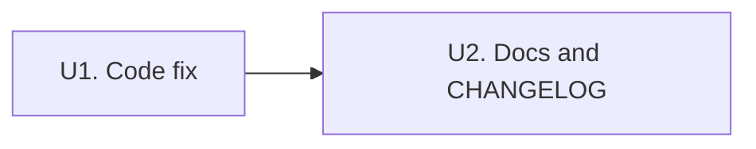

# fix: Switch SessionStart and PostCompact to additionalContext envelope

## Problem Frame

Lore's `SessionStart` hook (and `PostCompact`) emits its payload via `{"systemMessage": "..."}`. In
Claude Code's hook protocol, `systemMessage` is a terminal-only channel: it renders as a transient
chip to the user but never enters the model's conversation context. The lore intro and the
available-patterns index have therefore been invisible to Claude in every workspace, on every
`SessionStart` source (`startup`, `resume`, `clear`, `compact`) and on `PostCompact`, for the
lifetime of the integration.

Working envelope for context injection is
`{"hookSpecificOutput": {"hookEventName": "<event>", "additionalContext": "..."}}` — already used
correctly by lore's `PreToolUse` / `PostToolUse` paths and by peer plugins (e.g. superpowers) for
`SessionStart`.

Full diagnosis with transcript evidence: `tmp/lore-sessionstart-context-bug.md`.

## Summary

Change the `SessionStart` and `PostCompact` handlers in `src/hook.rs` to emit
`HookSpecific { additional_context, hook_event_name }` instead of `SystemMessage`. Delete the
now-unused `HookOutput::SystemMessage` variant and collapse `HookOutput` accordingly — no caller in
the codebase uses the chip-only channel after this change, and nothing in the configured plugin set
emits to it either.

`format_session_context` (the function that builds the payload string) is unchanged — only the
output envelope changes.

## Scope

**In scope**

- `src/hook.rs` — `handle_session_start` and `handle_post_compact` switch to the `HookSpecific`
  envelope.
- `src/hook.rs` — remove `HookOutput::SystemMessage` variant; collapse the `untagged` enum to a
  single struct shape (or single-variant enum) that serialises to `{"hookSpecificOutput": …}`.
- `tests/hook.rs` — update every assertion that reads `parsed["systemMessage"]` to read
  `parsed["hookSpecificOutput"]["additionalContext"]`, and the matching `hookEventName` field where
  useful as a regression guard against future event/envelope mismatches.
- Doc comments on `HookOutput` and the two handlers.
- `docs/hook-pipeline-reference.md` — the canonical event table and the `SessionStart` /
  `PostCompact` sections currently document `systemMessage` as the output field. Update to
  `additionalContext` and add a short note that the payload now lands in the model's context as a
  system reminder rather than a terminal chip.
- `CHANGELOG.md` — single user-facing entry under `[Unreleased]`.
- `ROADMAP.md` — no change needed (this is a bug fix, not a roadmap item).

**Out of scope**

- `format_session_context` behaviour, content, or truncation logic.
- `PreToolUse` / `PostToolUse` handlers — already correct.
- `hooks.json` config — no source matcher change needed; the harness delivers the same set of events
  regardless of envelope.
- The `tmp/lore-sessionstart-context-bug.md` bug doc — leave as-is for posterity; no need to move
  it.

### Deferred to Follow-Up Work

None. The fix is self-contained.

## Release posture

This fix is release-worthy on its own. The `SessionStart` / `PostCompact` pipeline has shipped
non-functional for the entire life of the integration — every prior release silently dropped the
pinned-conventions index and the meta-instruction on the floor. The behavioural delta on landing is
large enough (universals now actually seed the model context; agent adherence to pinned conventions
becomes observable from turn one) that bundling it into the next opportunistic release risks burying
it under unrelated work in the release notes.

After U1 + U2 land and the PR merges, cut a patch release per `docs/release-process.md`. Version
bump is a patch (`0.4.0` → `0.4.1`): the public CLI surface and configuration shape are unchanged;
only hook-output JSON shifts, and that channel is the harness's contract with Claude Code rather
than a documented user-facing API.

The CHANGELOG entry written in U2 carries the release notes content; no separate release-notes pass
is required.

## Key Technical Decisions

**Delete `HookOutput::SystemMessage`, do not retain as escape hatch.** Why: zero callers after this
change, and no other plugin in the configured set emits a chip via this envelope either. Keeping the
variant as "documented future flexibility" is speculative — re-adding it later when a real chip-only
event appears is a five-line struct, and a real caller will teach us the correct shape (per-event
matcher, level parameter, etc.) better than a preserved-just-in-case variant. The bug doc's
suggestion to retain it was a conservative aside, not load-bearing analysis. (Origin discussion:
scoping confirmation, this session.)

**Collapse the `untagged` enum if only one shape remains.** With `SystemMessage` removed,
`HookOutput` becomes a single-variant enum. Replace with a plain struct wrapping
`HookSpecificOutput`, or keep as a single-variant enum if call sites read more cleanly that way. The
implementer picks based on what reads best at the four `Ok(Some(...))` return sites in
`src/hook.rs`.

**`hookEventName` per call site.** The inner `hookEventName` must match the event being handled:
`"SessionStart"` in `handle_session_start`, `"PostCompact"` in `handle_post_compact`. This is
already how the `PreToolUse` / `PostToolUse` paths set it.

## Implementation Units

U2 follows U1 so the documentation describes the shipped behaviour, not a hypothetical state.

### U1. Switch hook envelopes and remove SystemMessage variant

**Goal:** `SessionStart` and `PostCompact` deliver their content as `additionalContext` so the model
sees it. Dead chip-only variant removed.

**Files:**

- `src/hook.rs` (modify)
- `tests/hook.rs` (modify — assertion shape only)

**Approach:**

- Replace the `Ok(Some(HookOutput::SystemMessage { … }))` at `src/hook.rs:161` with the
  `HookSpecific` envelope, `hookEventName =
  "SessionStart"`, `additionalContext = context`.
- Same change at `src/hook.rs:480` for `PostCompact`, with `hookEventName = "PostCompact"`.
- Remove the `SystemMessage` variant from the `HookOutput` enum (`src/hook.rs:62-65`) and its doc
  comment lines (`src/hook.rs:53-54`). If `HookOutput` now has a single variant, collapse to a
  struct or keep as a one-variant enum — implementer's call based on which reads more cleanly at the
  four return sites.
- Update the doc comment on `HookOutput` to reflect that all events use the `hookSpecificOutput`
  envelope.
- In `tests/hook.rs`, replace every read of `parsed["systemMessage"]` with
  `parsed["hookSpecificOutput"]["additionalContext"]`. Touch points identified by
  `git grep -nF systemMessage tests/`: lines 245, 247, 283, 327, 361, 363, 668, 669, 793, 797, 798,
  998, 1059, 1287, 1568. The line at 1568 is an assertion-message string only — update for
  consistency, no behavioural impact.
- For `SessionStart`-emitting tests and the `PostCompact` test, also assert that
  `parsed["hookSpecificOutput"]["hookEventName"]` equals the expected event name. This guards
  against future copy-paste mistakes that would put `"SessionStart"` on a `PostCompact` payload
  (which the harness silently ignores, reproducing the same class of bug).

**Test scenarios:**

- `SessionStart` JSON output has `hookSpecificOutput.additionalContext` containing the lore intro
  substring; no top-level `systemMessage` key present.
- `SessionStart` JSON output has `hookSpecificOutput.hookEventName == "SessionStart"`.
- `PostCompact` JSON output has `hookSpecificOutput.additionalContext` matching the `SessionStart`
  content for the same DB state (existing parity test at line ~793 continues to hold, just reading
  the new shape).
- `PostCompact` JSON output has `hookSpecificOutput.hookEventName == "PostCompact"`.
- Render-cap truncation test (line ~1565) still triggers and the truncation marker still appears in
  the new `additionalContext` field.
- All existing `PreToolUse` / `PostToolUse` tests continue to pass unchanged — they already use
  `hookSpecificOutput` and the enum collapse must not regress them.

**Verification:**

- `cargo test --test hook` green, with the renamed assertions in place.
- `cargo build` clean, no unused-variant or dead-code warnings.
- Manual: in a fresh Claude Code session with this build of `lore` installed, run the acceptance
  prompt from the bug doc verbatim:
  > Before doing anything else — no tool calls, no MCP, no file reads — tell me verbatim: do you
  > see, in your initial context, a system message that begins with the words "This project uses
  > lore for the author's strong coding preferences"? Quote the first sentence back if yes; say "no"
  > if not. Expected: yes, with the first sentence quoted.
- Repeat the acceptance prompt after `/clear` and `/compact`. Both should answer yes.
- Confirm the transient terminal chip is gone (intended trade-off — the payload is too long to be
  useful as a chip).

### U2. Update hook-pipeline reference and changelog

**Goal:** Documentation matches the shipped envelope. Release notes record the behavioural change
for users who notice the terminal chip disappear and the pinned conventions begin to take hold.

**Dependencies:** U1.

**Files:**

- `docs/hook-pipeline-reference.md` (modify)
- `CHANGELOG.md` (modify)

**Approach:**

- In `docs/hook-pipeline-reference.md`, replace the two `systemMessage` cells in the event table at
  lines 20 and 23 with `additionalContext`.
- In the `SessionStart` section (line 25 onwards), reword the "returns a `systemMessage`
  containing…" sentence to "returns an `additionalContext` payload containing…". The bulleted
  content description below is unaffected.
- In the `PostCompact` section (line 96 onwards), the prose at line 99 already says "re-emits the
  same content as SessionStart" — extend the same envelope clarification here so a reader sees both
  events use the same field.
- Add one short blockquote aside near the event table noting that the `SessionStart` and
  `PostCompact` payloads enter the model's context as a system reminder, not a transient terminal
  chip. This is the load-bearing user-visible change and merits an explicit callout given how long
  the previous behaviour shipped.
- Sweep the rest of the file with `git grep -nF systemMessage
  docs/` to confirm no stale
  references remain.
- In `CHANGELOG.md`, add an entry under `[Unreleased]` in the `Fixed` group following the project
  convention (assertive voice, one sentence, ends in `(#N)` once the PR is opened). Suggested
  wording:
  > `SessionStart` and `PostCompact` hook output now lands in the model's conversation context as
  > `additionalContext` instead of a terminal-only `systemMessage` chip, so the pinned-conventions
  > index and meta-instruction actually reach the agent on session start and after compaction. (#N)

**Test scenarios:**

- `Test expectation: none -- documentation and changelog edits with no
  executable surface.`
  Verification is the post-fix grep and a human read pass.

**Verification:**

- `git grep -nF systemMessage docs/` returns zero hits.
- `git grep -nF systemMessage README.md ROADMAP.md CONTRIBUTING.md` returns zero hits (confirms the
  surface really was confined to the pipeline reference; if any other surface turns up, fold it into
  this unit before commit).
- `CHANGELOG.md` `[Unreleased]` section contains the new `Fixed` bullet, and the bullet renders
  correctly under Keep a Changelog conventions (one assertive sentence, PR number suffix).
- `mdbook build docs` (or whatever the project uses to render the documentation tree) is clean — no
  broken anchor references introduced by the reword.

## Risks

- **Test churn surface.** ~15 assertion sites in `tests/hook.rs` reference `systemMessage`. A
  `git grep` after the edit pass must return zero hits before commit.
- **Envelope mismatch on `PostCompact`.** Easy to leave `hookEventName: "SessionStart"` in the
  `PostCompact` handler from a copy-paste. The harness will silently ignore mismatched event names,
  reproducing the exact class of bug this plan fixes. The per-event `hookEventName` assertion in
  U1's test scenarios catches this.
- **Plugin trace records.** Existing trace records under `$XDG_STATE_HOME/lore/traces/` were written
  with the old envelope. No migration is needed — traces are session-scoped and self-healing on new
  sessions. Mentioned for awareness, not action.

## References

- Bug context: `tmp/lore-sessionstart-context-bug.md`
- Lore hook source: `src/hook.rs:57-75` (envelope types), `:161` (`SessionStart` return), `:480`
  (`PostCompact` return)
- Working envelope precedent in same file: `src/hook.rs:340`, `:567` (`PreToolUse` / `PostToolUse`
  return sites)
- Test surface: `tests/hook.rs` — see line list in U1.
- Documentation surface: `docs/hook-pipeline-reference.md:18-23` (event table), `:25-39`
  (`SessionStart` section), `:96-101` (`PostCompact` section).
- Changelog: `CHANGELOG.md` `[Unreleased]` section.
