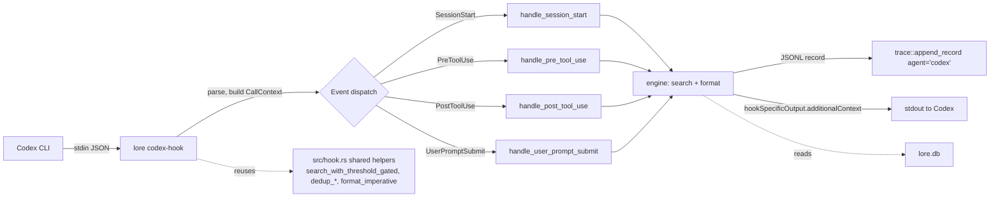

# feat: Codex CLI plugin

## Summary

Add a second hook adapter alongside the existing Claude Code one so lore's deterministic-injection
layer — SessionStart pinning, PreToolUse convention injection, PostToolUse error-driven lookup, and
the new `UserPromptSubmit` surface — fires inside OpenAI's Codex CLI. The engine module is reused
unchanged; the work is a new adapter module, a new CLI subcommand, and a new integration manifest
directory.

A handful of accumulated Claude-adapter fixes are lifted into shared helpers before the Codex
adapter consumes them, so a third adapter (Cursor, opencode) inherits the same invariants. Real
Codex stdin captures land as test fixtures before the adapter is written, and shipping is gated on a
model-side delivery check (asking a live Codex session to quote a SessionStart payload back), not on
hook-exit-zero.

---

## Problem Frame

lore today ships a Claude Code plugin at `integrations/claude-code/`. Users on Codex CLI can
configure the MCP server standalone, but the deterministic-injection layer that makes lore
load-bearing on Claude — SessionStart pinning of universal conventions, PreToolUse convention
injection on file edits and shell calls, PostToolUse error-driven pattern lookup — is unavailable.
The engine module (`src/engine/`) is already agent-agnostic per the Track 1 split (PR #39), so a
second integration is a thin adapter and a manifest directory, not a new subsystem.

See origin: `docs/brainstorms/2026-06-08-codex-plugin-requirements.md`.

---

## Requirements

R-IDs are plan-local. R1–R10 map 1:1 to the origin's Success criteria bullets 1–10 in order. R11 is
a plan-time addition naming the model-side delivery shipping gate (KTD-5) surfaced by the
prior-incident learning at
`docs/solutions/integration-issues/verify-host-delivery-not-just-hook-exit-2026-05-22.md`.

- **R1.** A fresh Codex session in a lore-indexed repository emits the `## Pinned conventions` block
  at SessionStart.
- **R2.** An `apply_patch` tool call injects the conventions relevant to the touched file's language
  via `additionalContext`.
- **R3.** A `Bash` tool call injects conventions relevant to the recognised binary or language.
- **R4.** A failed `Bash` command triggers PostToolUse pattern lookup against the error output.
- **R5.** A `UserPromptSubmit` event injects conventions whose keywords match the submitted prompt
  text.
- **R6.** A `/compact` re-emits `## Pinned conventions` via SessionStart with `source: "compact"`.
- **R7.** `search_patterns` and `add_pattern` MCP tools are callable from Codex via the bundled
  `lore serve` stdio server.
- **R8.** The `search` and `coverage-check` skills are explicitly invokable inside Codex through
  supported skill/plugin surfaces (`/skills`, `$skill`, or `@plugin`). Direct `/lore:*` slash
  commands are accepted only if the Codex CLI exposes installed plugin skills that way.
- **R9.** The Codex adapter records hook activity through `trace::append_record` with
  `agent = "codex"`, so `lore trace why <session>` works across both agents.
- **R10.** New Codex adapter tests pin the wire contract; existing Claude integration tests in
  `tests/hook.rs` and `tests/invariants.rs` continue to pass.
- **R11.** Shipping is gated on a model-side delivery check inside a real Codex session — the agent
  quoting the SessionStart pinned-conventions payload back — not on hook-process exit zero (see
  KTD-5).

---

## Key Technical Decisions

- **KTD-1. Parallel adapter module, engine extended by a small seam.** `src/codex_hook.rs` mirrors
  `src/hook.rs`. The engine module gains a small set of additions in U3 (a new `prompt` field on
  `CallContext`, an extracted `engine::query::query_from_error_text` helper) but no architectural
  reshape. Already-pub helpers in `src/hook.rs` (`search_with_threshold_gated`, `format_imperative`,
  `dedup_file_path`/`read_dedup`/`write_dedup`/`reset_dedup`, `sanitize_for_log`,
  `PINNED_SECTION_TOTAL_LIMIT_BYTES`) plus the pipeline helpers promoted to `pub(crate)` in U3
  (`expand_to_siblings`, `apply_predicate_filter`, `dedup_filter_and_record`, `session_dedup_path`,
  `validate_transcript_path`, `last_user_message`, `tool_input_str`, `skip_agent`,
  `apply_relevance_thresholds`, the `snapshot_*` / `emit_*_trace` family) are called from the new
  adapter unchanged. The pipeline ordering in `handle_pre_tool_use` (skip_agent → to_call_context →
  engine::extract_query → search_with_threshold_gated → expand_to_siblings → apply_predicate_filter
  → dedup_filter_and_record → trace → format_imperative) is reproduced step-for-step in the Codex
  handler.
- **KTD-2. Separate `lore codex-hook` subcommand, not auto-detect.** No flag-switched router, no
  stdin-shape sniffer. Cleaner failure-mode diagnosis: when a hook misbehaves the failing adapter is
  unambiguous from the command line that ran. See origin: brainstorm "What we are building" §2.
- **KTD-3. Reuse the existing `HookOutput`/`HookSpecificOutput` envelope.** Codex's wire-contract
  uses the same `hookSpecificOutput.additionalContext` camelCase envelope as Claude (verified
  against `codex-rs/hooks/src/schema.rs`). No second output type needed; serialise via
  `lore::hook::HookOutput::additional_context(...)` from the Codex adapter.
- **KTD-4. New `CodexHookInput` for stdin parsing.** Codex's stdin shape differs from Claude's
  (`turn_id`, `tool_use_id`, `permission_mode`, `model`, and per-event extras like `prompt` for
  UserPromptSubmit and `source` for SessionStart). A dedicated `CodexHookInput` deserialises the
  Codex envelope and implements `to_call_context() -> CallContext` to feed the engine.
- **KTD-5. Model-side delivery is the shipping bar.** Prior incident
  (`docs/solutions/integration-issues/verify-host-delivery-not-just-hook-exit-2026-05-22.md`): the
  Claude adapter shipped emitting `{"systemMessage": ...}` from SessionStart for the integration's
  lifetime; exit 0, host logged success, terminal rendered a chip, model never saw the payload. The
  Codex adapter is not shipped until a live Codex session is asked to quote a SessionStart payload
  back and does so.
- **KTD-6. Prepare the engine seam before the consumer adapter lands.** Two existing seams are leaky
  in ways that block clean parallel adapter use: (a) The PostToolUse stderr→FTS5 query construction
  at `src/hook.rs:592-598` is built inline (`split_into_words` → `clean_terms` →
  `cleaned.join(" OR ")`) and bypasses `engine::assemble_fts_query`. Both adapters' PostToolUse
  handlers would duplicate this same sibling path unless it lifts into a new
  `engine::query::query_from_error_text(stderr: &str) -> Option<String>` they both call. (b) The
  pipeline helpers `expand_to_siblings`, `apply_predicate_filter`, `dedup_filter_and_record`, plus
  `session_dedup_path`, `validate_transcript_path`, `last_user_message`, `tool_input_str`,
  `skip_agent`, `apply_relevance_thresholds`, and the `snapshot_*` / `emit_*_trace` family are
  private in `src/hook.rs`. Promote them to `pub(crate)` so both adapters share the pipeline.

  Explicitly NOT in scope of this lift: the bodies of `validate_transcript_path` and
  `last_user_message`, and the dedup file lifecycle — these are adapter-only filesystem operations
  that must stay in the adapter modules per the engine no-disk-read invariant pinned by
  `tests/invariants.rs::no_unsanctioned_runtime_disk_reads_in_hook_server_main`. The FTS5
  sanitisation already lives in `src/engine/query.rs` per PR #39 (per `src/hook.rs::extract_query`
  "thin shim" doc comment); no further sanitisation lift is needed there.
- **KTD-7. Add a `prompt: Option<String>` field to `CallContext`, read unconditionally by the
  engine.** Routing the Codex `prompt` through the existing `CallContext.command` field fails by
  construction: `engine::query::harvest_terms` and `infer_languages`
  (`src/engine/query.rs:140, :179`) gate command/description reads on `tool_name == TOOL_BASH`, so
  `prompt → command` with `tool_name = None` returns an empty query (R5 silently never fires), and
  `tool_name = "Bash"` synthesised would trip every `bash_command_starts_with` predicate on any
  prompt mentioning `git` / `cargo` (noise generator). The cleanest fix is a new field —
  `prompt: Option<String>` on `CallContext` (`src/engine/call_context.rs`), read unconditionally by
  `harvest_terms` and `infer_languages`. The Claude adapter populates it as `None`; the Codex
  `handle_user_prompt_submit` populates it with the prompt text. This change lands in U3 so the
  engine seam is ready before U4 consumes it.
- **KTD-8. Coverage-check skill update is a follow-up, not in-scope.** The skill simulates
  Claude-shaped queries today. Codex's `apply_patch` will produce different queries; the skill
  should learn the Codex shape eventually. Out of scope for this plan — filed in Deferred to
  Follow-Up Work.
- **KTD-9. CLI behaviour ladder classification per event.** Per workspace rule
  (`docs/solutions/conventions/cli-behaviour-ladder-2026-05-10.md` and memory
  `project_cli_behaviour_ladder`), every edge case is classified into tier-1 (hard-fail) / tier-2
  (warn) / tier-3 (silent) before implementation. The Codex adapter classifications:
  - Malformed JSON on stdin → tier-3 (silent, exit 0, no stdout) — hooks never break the agent.
  - Unknown `hook_event_name` → tier-3.
  - Unparseable `apply_patch` unified-diff → tier-3.
  - Multi-file diff where one file fails to parse but others succeed → tier-2 (warn on stderr,
    proceed with the parseable files).
  - Unknown SessionStart `source` value → tier-2 (warn on stderr, treat as `startup`).
  - Bind to the existing `lore hook` swallow-and-eprintln pattern in `src/main.rs::cmd_hook_inner`.

---

## High-Level Technical Design

The adapter is one box in a four-box pipeline. The engine and trace surfaces are stable; the new
adapter slots in next to the Claude one.



Directional only. The actual call shape inside `handle_*` mirrors `src/hook.rs` step-for-step; the
per-event differences are confined to stdin parsing and the `source`/`prompt` field handling.

`apply_patch` unified-diff parsing (the only piece of net-new logic per the brainstorm) extracts
file paths from `+++ b/<path>` headers and treats `+` lines as the convention-relevant content. The
resulting `file_path` and `command` (here meaning "edit body") feed `CallContext` exactly as the
Claude adapter feeds them from `Edit`/`Write` tool_input.

---

## Output Structure

The plan creates a new integration directory mirroring `integrations/claude-code/`:

```
integrations/codex/
├── .codex-plugin/
│   ├── plugin.json
│   └── README.md
├── hooks/
│   └── hooks.json
├── .mcp.json
└── skills/
    ├── search/
    │   └── SKILL.md
    └── coverage-check/
        └── SKILL.md
```

The tree is a scope declaration. Per-unit `**Files:**` sections remain authoritative.

---

## Implementation Units

### U1. Capture real Codex stdin fixtures

- **Goal:** snapshot one real Codex stdin JSON per relevant event and tool combination from a live
  Codex session; commit them as test fixtures.
- **Requirements:** R10, R11 (precondition).
- **Dependencies:** none.
- **Files:** `tests/fixtures/codex/session_start_startup.json`,
  `tests/fixtures/codex/session_start_compact.json`,
  `tests/fixtures/codex/pre_tool_use_apply_patch_single_file.json`,
  `tests/fixtures/codex/pre_tool_use_apply_patch_multi_file.json`,
  `tests/fixtures/codex/pre_tool_use_bash.json`,
  `tests/fixtures/codex/post_tool_use_bash_error.json`,
  `tests/fixtures/codex/user_prompt_submit.json`.
- **Approach:** install a temporary stub `lore codex-hook` that reads stdin and writes it to
  `tmp/codex-fixtures-raw/codex-stdin-<event>-<timestamp>.json`, configure Codex to invoke it via
  `integrations/codex/hooks/hooks.json`, drive each event from a live Codex session in a real repo:
  one fresh-start SessionStart (`startup`); one `/compact` for the SessionStart-source-compact
  capture; one `apply_patch` against a single file; one `apply_patch` against a multi-file diff; one
  `Bash` invocation that succeeds (captures only the PreToolUse since PostToolUse is wired only to
  the error matcher); one `Bash` invocation that fails (captures PreToolUse plus the PostToolUse
  error record); one user-prompt submission. Use workspace-local scratch only (`tmp/codex-home/`,
  `tmp/codex-fixtures-raw/`, `tmp/codex-hook-logs/`) and hand-review each capture for sensitive
  content before committing sanitized fixtures.
- **Execution note:** this unit blocks every subsequent unit. The fixtures are the source of truth
  for U4's parser and U7's integration tests.
- **Patterns to follow:** none — this is a new fixture shape. Hand-review for sensitive content
  (paths, tokens, prompts) before commit.
- **Test scenarios:** _Test expectation: none -- pure fixture capture._ Validation happens
  implicitly when U4 and U7 consume them.
- **Verification:** each event variant is represented; each file is valid JSON
  (`jq . < file > /dev/null` passes); no sensitive content in committed fixtures. The captured
  `pre_tool_use_apply_patch_*.json` fixtures confirm `tool_input.patch` is the actual field name
  carrying the unified-diff string (the only unverified field name in the brainstorm's Verified
  Codex hook surface section); if a different field name is observed, update KTD-4 and U4's parser
  spec before starting U4.

### U2. Add `AGENT_CODEX` trace constant

- **Goal:** introduce the second agent identifier so trace records discriminate Codex from Claude.
- **Requirements:** R9.
- **Dependencies:** none.
- **Files:** `src/trace/record.rs`.
- **Approach:** add `pub const AGENT_CODEX: &str = "codex";` next to `AGENT_CLAUDE_CODE`. The
  `TraceRecord::agent` field is already `String`, so no enum change is needed. Existing
  `lore trace why --agent` filter already expects this shape.
- **Patterns to follow:** the existing `AGENT_CLAUDE_CODE` constant and its doc comment.
- **Test scenarios:** add a unit test in `record.rs::tests` that constructs a `PreToolUseRecord`
  with `agent = AGENT_CODEX` and round-trips through JSON serialisation/deserialisation, asserting
  `agent == "codex"`.
- **Verification:** `cargo test trace::record` passes; `cargo build` clean.

### U3. Engine seam preparation: lift PostToolUse stderr query, promote pipeline helpers, add `prompt` field

- **Goal:** ready the engine for parallel adapter consumption — lift the one leaky FTS5 query
  construction still in `src/hook.rs`, promote private pipeline helpers so both adapters share the
  pipeline, and add a `prompt` field to `CallContext` so UserPromptSubmit can flow through
  `engine::extract_query` cleanly.
- **Requirements:** R5, R10 (no regressions); KTD-1, KTD-6, KTD-7.
- **Dependencies:** none (independent of U1; touches engine + hook only).
- **Files:** `src/engine/query.rs`, `src/engine/call_context.rs`, `src/hook.rs` (visibility
  promotions + PostToolUse call-site update), `src/engine/mod.rs` (re-exports if needed).
- **Approach:**
  - **Lift PostToolUse stderr→FTS5 query** (`src/hook.rs:592-598`) into a new
    `pub fn query_from_error_text(stderr: &str) -> Option<String>` in `src/engine/query.rs`. The
    body runs `split_into_words` → `clean_terms` → `assemble_fts_query` with no language anchor
    (preserving existing PostToolUse behaviour, just consolidated). Update `src/hook.rs`'s
    PostToolUse path to call it; U5's Codex PostToolUse handler calls the same function.
  - **Promote private pipeline helpers in `src/hook.rs` to `pub(crate)`** so the Codex adapter can
    call them unchanged: `expand_to_siblings`, `apply_predicate_filter`, `dedup_filter_and_record`,
    `session_dedup_path`, `validate_transcript_path`, `last_user_message`, `tool_input_str`,
    `skip_agent`, `apply_relevance_thresholds`, plus the `snapshot_*` / `emit_*_trace` family.
    Visibility only — no body changes. The inline `#[cfg(test)] mod tests` retains access via
    `super::*`.
  - **Add `prompt: Option<String>` to `CallContext`** (`src/engine/call_context.rs`); update the
    `empty()` constructor to return `prompt: None`. Extend `engine::query::harvest_terms` and
    `engine::query::infer_languages` to also read `ctx.prompt.as_deref()` — **unconditionally, no
    `tool_name` gate** — routing prompt terms through the same `clean_terms` pipeline that handles
    command and description. The Claude adapter's `HookInput::to_call_context` sets `prompt: None`;
    the Codex `handle_user_prompt_submit` sets it to the prompt text.
  - **Audit `HookOutput` / `HookSpecificOutput` visibility** in `src/hook.rs`: confirm the
    constructor `HookOutput::additional_context` and the underlying struct fields are accessible
    from `src/codex_hook.rs`. Promote to `pub(crate)` where needed. This pins KTD-3 (envelope
    reuse).
- **Patterns to follow:** existing `pub fn extract_query` shim shape at `src/hook.rs:1089` for the
  call-site reorganisation; existing `engine::assemble_fts_query` shape for the new
  `query_from_error_text` helper.
- **Test scenarios:**
  - **Happy path (PostToolUse lift):**
    `query_from_error_text("error: failed to compile foo.rs at line 42")` returns a non-empty FTS5
    query containing `failed`, `compile`, `foo`, `rs`.
  - **Edge case (PostToolUse lift):** `query_from_error_text("")` returns `None`.
  - **Edge case (PostToolUse lift):** stderr cleaning to only stop-words returns `None`, leaves a
    `LORE_DEBUG` zero-query breadcrumb.
  - **Happy path (prompt routing):**
    `harvest_terms(CallContext { prompt: Some("help me refactor rust"), ..empty() })` includes
    `refactor` and `rust` after cleaning.
  - **Negative pin (prompt routing):**
    `evaluate_applies_when(predicate { bash_command_starts_with: ["git"] }, CallContext { prompt: Some("run git status"), tool_name: None, ..empty() })`
    returns `false` — prompt content does NOT trip Bash-prefixed predicates.
  - **Language inference on prompt:**
    `infer_languages(CallContext { prompt: Some("rewrite this in TypeScript"), ..empty() })`
    includes `typescript`.
  - **Regression:** existing `tests/hook.rs` PostToolUse tests pass unchanged — the lifted helper
    produces byte-identical queries to the inline construction for the existing test inputs.
  - **Regression:** `tests/invariants.rs::no_unsanctioned_runtime_disk_reads_in_hook_server_main`
    still passes (no disk I/O moved into the engine).
- **Verification:** `cargo test` clean across all targets;
  `cargo clippy --all-targets -- -D warnings` clean; engine no-fs-read invariant still pinned.

### U4. Codex stdin parsing + `CallContext` translation

- **Goal:** define `CodexHookInput` and translate every event/tool variant into a `CallContext` the
  engine consumes.
- **Requirements:** R1–R6, R10.
- **Dependencies:** U1, U3.
- **Files:** `src/codex_hook.rs` (new), `src/lib.rs` (add `pub mod codex_hook;`).
- **Approach:** mirror `src/hook.rs`'s `HookInput` struct and `to_call_context` method, with these
  differences:
  - Codex stdin fields: `hook_event_name`, `session_id`, `turn_id`, `tool_name`, `tool_input`
    (`serde_json::Value`), `tool_response` (PostToolUse only), `transcript_path`, `cwd`, `model`,
    `permission_mode`, plus per-event extras (`prompt` for UserPromptSubmit, `source` for
    SessionStart). All non-`hook_event_name` fields are `Option<...>` per the brainstorm verified
    surface.
  - Tool dispatch: `tool_name == "apply_patch"` → parse `tool_input.patch` (unified diff) → extract
    first `+++ b/<path>` for `file_path` and concatenated `+`-line bodies for `command`.
    `tool_name == "Bash"` → read `tool_input.command` and `tool_input.description` exactly as Claude
    does.
  - Per KTD-7, UserPromptSubmit populates the new `CallContext.prompt` field (added in U3) with the
    prompt text; `engine::extract_query` reads it unconditionally. `tool_name` stays `None` for
    UserPromptSubmit so Bash-gated predicates do not misfire.
  - Per KTD-9, malformed inputs degrade silently (return `CallContext::empty()`), multi-file diff
    with partial parse failure warns on stderr and proceeds.
- **Execution note:** test-first — write the unit tests against the U1 fixtures before the parsing
  functions.
- **Patterns to follow:** `src/hook.rs::HookInput`, `src/hook.rs::HookInput::to_call_context`, SPDX
  header, module-level doc comment in `//!` form.
- **Test scenarios:**
  - SessionStart with `source: "startup"` → `CallContext::empty()`; `source` field captured for
    downstream dispatch (not in CallContext, in the handler's local).
  - SessionStart with `source: "compact"` → same shape; handler later uses source to decide whether
    to reset dedup.
  - PreToolUse `apply_patch` single-file → CallContext.file_path = path from diff header,
    CallContext.command = concatenated `+` lines.
  - PreToolUse `apply_patch` multi-file → file_path = first file from diff; concatenated `+` lines
    from all files; one stderr warning per file that fails to parse if any.
  - PreToolUse `Bash` → CallContext.command = tool_input.command, CallContext.description =
    tool_input.description.
  - PostToolUse `Bash` with non-zero exit → CallContext.command = tool_input.command,
    CallContext.description = tool_response.stderr (truncated to existing transcript-tail byte
    limit).
  - UserPromptSubmit → CallContext.prompt = prompt text, CallContext.command = None,
    CallContext.tool_name = None.
  - Malformed `tool_input` (not an object) → `CallContext::empty()`, no panic.
  - Malformed unified diff (no `+++ b/` header) → `CallContext::empty()`, no panic.
  - Unknown `tool_name` → `CallContext::empty()`.
  - **Covers R2, R3, R4, R5, R6** via the success-criteria mapping in Requirements.
- **Verification:** `cargo test codex_hook::tests` passes; all U1 fixtures parse without panic.

### U5. Codex hook event handlers

- **Goal:** implement `handle_session_start`, `handle_pre_tool_use`, `handle_post_tool_use`,
  `handle_user_prompt_submit` in `src/codex_hook.rs`, plus a top-level `handle_hook` dispatcher.
- **Requirements:** R1–R6, R9.
- **Dependencies:** U2, U4.
- **Files:** `src/codex_hook.rs` (extend), `tests/invariants.rs` (allow-list update — see below).
- **Approach:** reproduce the `src/hook.rs` handler structure step-for-step. Specifically:
  - `handle_session_start`: render pinned conventions via the existing engine path; gate dedup reset
    on `source == "startup" | "clear" | "compact"` (mirroring KTD-9). For `source == "resume"`, do
    not reset.
  - `handle_pre_tool_use`: skip_agent first; build CallContext; call `engine::extract_query` →
    `search_with_threshold_gated` → `expand_to_siblings` → `apply_predicate_filter` →
    `dedup_filter_and_record` → trace write → `format_imperative` → wrap in
    `HookOutput::additional_context("PreToolUse", body)`.
  - `handle_post_tool_use`: only fire when `tool_response` reports non-zero exit (mirror the Claude
    adapter's PostToolUse error gate).
  - `handle_user_prompt_submit`: build CallContext from `prompt`; reuse the PreToolUse pipeline from
    extract_query onward; wrap as `HookOutput::additional_context("UserPromptSubmit", body)`.
  - All trace::append_record calls use `agent: AGENT_CODEX.to_string()`.
  - All four handlers honour the CLI behaviour ladder (KTD-9).
  - Update `tests/invariants.rs::no_unsanctioned_runtime_disk_reads_in_hook_server_main` allow-list
    to include the new `codex_hook` module's filesystem reads (transcript tail, dedup file).
- **Patterns to follow:** the entire pipeline in `src/hook.rs::handle_pre_tool_use` (lines ~248–399
  per repo-research); `format_session_context` and `render_pinned_conventions` for SessionStart
  shape.
- **Test scenarios:** unit tests inline in `codex_hook::tests`:
  - SessionStart startup with universal patterns seeded → output contains `## Pinned conventions`
    block, dedup file is reset.
  - SessionStart compact with universal patterns seeded → output contains `## Pinned conventions`,
    dedup file is reset (KTD-9 source matrix).
  - SessionStart resume → output is `None` (no re-prime) and dedup file is preserved.
  - PreToolUse `apply_patch` for a Rust file → output contains the Rust conventions pattern title.
  - PreToolUse `Bash` running `cargo build` → output contains Rust/cargo conventions pattern title.
  - PostToolUse `Bash` exit=1 with stderr containing "no such file or directory" → output contains
    shell-error conventions if any patterns are tagged; output is `None` otherwise.
  - UserPromptSubmit with prompt "let's refactor the rust hook code" → output contains Rust
    conventions (KTD-7 pipeline).
  - Dedup: same pattern injected twice in one session via PreToolUse fires only once.
  - Trace: after a PreToolUse run, the trace dir contains a record with `agent == "codex"`.
- **Verification:** `cargo test codex_hook` passes; `tests/invariants.rs` passes after the
  allow-list update.

### U6. `lore codex-hook` CLI subcommand

- **Goal:** wire the new adapter into the binary so `lore codex-hook` is invokable.
- **Requirements:** R10.
- **Dependencies:** U5.
- **Files:** `src/main.rs`.
- **Approach:** add `Commands::CodexHook` next to `Commands::Hook` (mirroring the doc comment shape
  with `/// Process an OpenAI Codex CLI lifecycle hook`); dispatch in `main()` to a new
  `cmd_codex_hook(&config_path)`. Define `cmd_codex_hook` modelled on `cmd_hook`/`cmd_hook_inner` —
  error-swallowing pattern with `eprintln!("lore codex-hook: {e}")` plus `lore_debug!`, return
  `Ok(())` always (hooks must not break the agent). The `#[allow(clippy::unnecessary_wraps)]`
  attribute is required.
- **Patterns to follow:** `src/main.rs::cmd_hook_inner` lines ~693–721 (per repo-research).
- **Test scenarios:**
  - Smoke: `cargo run -- codex-hook` with malformed JSON on stdin exits 0 and writes nothing to
    stdout.
  - Smoke: `cargo run -- codex-hook` with a valid SessionStart fixture from U1 exits 0 and writes a
    `hookSpecificOutput.additionalContext` JSON envelope to stdout.
- **Verification:** `cargo build` clean; smoke tests above run by hand or as part of U7.

### U7. Integration tests in `tests/codex_hook.rs`

- **Goal:** end-to-end test the binary against the U1 fixtures.
- **Requirements:** R1–R6, R9, R10.
- **Dependencies:** U6.
- **Files:** `tests/codex_hook.rs` (new), possibly `tests/common/mod.rs` for shared helpers (only if
  extraction from `tests/hook.rs` is genuinely cheap; otherwise duplicate the setup helpers).
- **Approach:** mirror `tests/hook.rs`'s shape —
  `assert_cmd::Command::cargo_bin("lore").args(["codex-hook", "--config", ...]).write_stdin(<fixture JSON>).assert().success()`.
  Setup helpers: `write_config(dir, db_path)` (hybrid = false for FTS-determinism), `open_db`,
  `seed_patterns`, `setup_test_env`, `FakeEmbedder::new()`, `ingest::ingest`. Assertions: stdout
  parses as JSON, `hookSpecificOutput.additionalContext` matches expected substring, trace dir
  contains the expected record.
- **Patterns to follow:** `tests/hook.rs` end-to-end shape — write_config, seed_patterns,
  invoke_session_start. Use the U1 fixtures via `include_str!("fixtures/codex/*.json")`.
- **Test scenarios:**
  - **Covers R1.** SessionStart startup with seeded universal patterns → stdout `additionalContext`
    includes `## Pinned conventions`.
  - **Covers R6.** SessionStart compact → same content, dedup file reset.
  - **Covers R2.** PreToolUse apply_patch single-file (`.rs` target) with Rust patterns seeded →
    stdout contains the Rust conventions title.
  - **Covers R2.** PreToolUse apply_patch multi-file (mixed `.rs` and `.ts`) → stdout contains both
    language families' conventions if seeded.
  - **Covers R3.** PreToolUse Bash `cargo test` → stdout contains testing conventions if seeded.
  - **Covers R4.** PostToolUse Bash exit=1 with stderr text → stdout contains relevant error-domain
    patterns if seeded; otherwise stdout is empty JSON envelope or absent.
  - **Covers R5.** UserPromptSubmit "help me with rust" → stdout contains Rust conventions.
  - **Covers R9.** After any run above, `$XDG_STATE_HOME/lore/traces/<session>.jsonl` contains
    records with `agent == "codex"`.
  - Edge case: malformed JSON on stdin → exit 0, stdout empty.
  - Edge case: empty stdin → exit 0, stdout empty.
- **Verification:** `cargo test --test codex_hook` passes; existing `cargo test --test hook`
  continues to pass.

### U8. `integrations/codex/` plugin manifest

- **Goal:** assemble the Codex plugin manifest directory mirroring `integrations/claude-code/`, and
  run the model-side delivery check on a real Codex session.
- **Requirements:** R1, R6, R7, R8, R11.
- **Dependencies:** U6 (CLI subcommand must exist for hooks.json to invoke it), U7 (adapter must
  pass its own tests before exposure to a real agent).
- **Files:** `integrations/codex/.codex-plugin/plugin.json`,
  `integrations/codex/.codex-plugin/README.md`, `integrations/codex/hooks/hooks.json`,
  `integrations/codex/.mcp.json`, `integrations/codex/skills/search/SKILL.md`,
  `integrations/codex/skills/coverage-check/SKILL.md`, `.agents/plugins/marketplace.json`.
- **Approach:**
  - Read codex source `codex-rs/skills/src/` (or equivalent) to confirm SKILL.md frontmatter
    compatibility with Claude Code's `disable-model-invocation` and `user-invocable` keys; adjust
    per skill if Codex requires different keys.
  - Author each manifest file per the brainstorm-verified shape. `hooks.json` subscribes
    SessionStart (no `source` matcher — adapter receives all four sources `startup` / `resume` /
    `clear` / `compact` and handles `resume` as a no-op internally per U5), PreToolUse
    (`"^(apply_patch|Bash)$"`), PostToolUse (`"^Bash$"`), UserPromptSubmit (no matcher), each
    invoking `lore codex-hook`. Field-shape deltas to apply when porting from
    `integrations/claude-code/hooks/hooks.json`: keep `"timeout": 10`; Claude's pipe-list matcher
    (`"Edit|Write|Bash"`) → anchored regex (`"^(apply_patch|Bash)$"`); plus any other envelope
    differences U1's captured fixtures surface.
  - Verify Codex plugin MCP packaging against the local Codex version before UAT. Default shape is
    `integrations/codex/.mcp.json` referenced from `.codex-plugin/plugin.json`; if Codex requires a
    different key or filename, update this plan and the hook-pipeline reference before
    implementation continues.
  - Port skill bodies verbatim from `integrations/claude-code/skills/` — only the frontmatter is
    reviewed.
  - Port the `.claude-plugin/README.md` house-style + lettered-options-block conventions into
    `.codex-plugin/README.md`.
  - Install locally through the in-repo Codex marketplace manifest at
    `.agents/plugins/marketplace.json`, pointing at `./integrations/codex`. Use workspace-local
    state for UAT: `CODEX_HOME="$PWD/tmp/codex-home" codex plugin marketplace add "$PWD"` followed
    by `CODEX_HOME="$PWD/tmp/codex-home" codex plugin add lore-codex@lore-local`.
  - Run the prior-incident-driven UAT: a fresh Codex session, asked to quote the contents of the
    `## Pinned conventions` block back. Pass if the model reproduces a recognisable fragment. Fail
    if the model says it sees no such block — that means we shipped a Claude-PostCompact-style
    invisible payload.
- **Patterns to follow:** `integrations/claude-code/.claude-plugin/plugin.json`,
  `integrations/claude-code/hooks/hooks.json`, `integrations/claude-code/mcp.json`,
  `integrations/claude-code/skills/{search,coverage-check}/SKILL.md`,
  `integrations/claude-code/.claude-plugin/README.md` (skill naming convention), plus
  `.agents/plugins/marketplace.json` for Codex local marketplace testing.
- **Test scenarios:** _Test expectation: none -- pure manifest authoring plus a manual UAT step._
  See Verification for the UAT recipe.
- **Verification:**
  - Each JSON file parses (`jq . < file > /dev/null`).
  - Codex starts cleanly with the plugin installed (no duplicate-hooks errors, no MCP-discovery
    failures — see
    `docs/solutions/integration-issues/claude-code-plugin-assembly-pitfalls-2026-04-02.md`).
  - The search skill returns results in the Codex session through a supported explicit invocation
    surface (`/skills`, `$skill`, or `@plugin`). Direct `/lore:search rust` is verified only if the
    installed Codex CLI exposes plugin skills as slash commands.
  - **Model-side delivery (R11, KTD-5):** seed a recognisable sentinel token into one of the
    universal patterns before the UAT — an unusual string distinct enough that a model summarising
    rather than quoting won't reproduce it by chance (e.g. a UUID, a deliberately mis-spelled marker
    phrase, or a kebab-cased neologism). Open a fresh Codex session in a lore-indexed checkout and
    ask the agent to "quote the line containing `<sentinel>` from your current context". **Pass:**
    the agent reproduces the line verbatim. **Fail-mode diagnostic ladder:** (a) "no such line
    exists" → SessionStart payload not delivered — check hook stdout JSON shape and host validator
    logs; (b) agent paraphrases rather than quotes verbatim → payload delivered but truncated or
    position-buried — check `additionalContext` byte length against
    `PINNED_SECTION_TOTAL_LIMIT_BYTES`; (c) first-turn UAT fails but a later turn surfaces the
    sentinel → known `additionalContext` first-call invisibility on PreToolUse (see Deferred to
    Follow-Up Work — `additionalContext` timing audit). For (a) and (b), the adapter is not shipped
    — go back to U5 or U7. For (c), document the timing asymmetry as a known limitation in the
    `codex_hook` module doc comment and ship.

### U9. `ROADMAP.md` and `CHANGELOG.md` update

- **Goal:** move the Codex CLI plugin entry to Completed in `ROADMAP.md`; add one user-facing line
  to `CHANGELOG.md`.
- **Requirements:** project conventions.
- **Dependencies:** U8 (UAT passes before declaring done).
- **Files:** `ROADMAP.md`, `CHANGELOG.md`.
- **Approach:** per project memories `feedback_roadmap_update_in_feature_pr` and
  `feedback_changelog_entries`. Leave the existing
  `Additional agent integrations (Cursor, opencode)` Future bullet untouched. CHANGELOG line in
  assertive voice, ending in `(#N)`. See origin: brainstorm "ROADMAP and CHANGELOG" §.
- **Patterns to follow:** existing `## Completed` entries in `ROADMAP.md` for shape and prose
  density; existing `CHANGELOG.md` entries for tone.
- **Test scenarios:** _Test expectation: none -- documentation update._
- **Verification:** the PR description references the new entry and the changelog line;
  `dprint check` (if configured for markdown) passes.

---

## Scope Boundaries

### Deferred for later (carried from origin)

- `PreCompact` hook wiring.
- `PermissionRequest`, `Subagent*`, and `Stop` hooks.
- `updatedInput` rewrite power on PreToolUse.
- MCP tool calls in the PreToolUse matcher (kept narrow to `^(apply_patch|Bash)$`).
- Public marketplace publishing / Homebrew tap. Local Codex testing uses the in-repo marketplace
  manifest; public Claude/Codex marketplace distribution follows as a separate roadmap item.
- A single auto-detecting `lore hook` subcommand replacing both adapters.
- Linux / Windows install instructions.

### Deferred to Follow-Up Work

- **Coverage-check skill: Codex-shape query simulation.** The skill currently simulates the Claude
  adapter's query construction. Codex's `apply_patch` produces different queries. File a follow-up
  issue: "Teach `/lore:coverage-check` the Codex adapter's query shape so coverage measurements stay
  honest under Codex." See
  `docs/solutions/best-practices/coverage-check-query-source-must-simulate-hook-not-llm-2026-04-08.md`.
- **`additionalContext` timing audit on Codex.** Per
  `docs/solutions/integration-issues/additional-context-timing-in-pretooluse-hooks-2026-04-02.md`,
  the Claude PreToolUse contract delivers context the model only sees on the next tool call. Codex's
  actual timing is unknown. Audit empirically post-ship; document in the `codex_hook` module doc
  comment.
- **Per-pattern Codex-only `applies_when` tuning.** The predicate engine is reused unchanged, but
  trace data from real Codex sessions may surface different bleed patterns than Claude. Defer trace
  analysis until at least a week of Codex traces exist.

---

## Open Questions

Resolved in-plan per the synthesis call-outs. Tracked for re-confirmation during implementation:

1. **Codex `SKILL.md` frontmatter compatibility** — does Codex respect Claude's
   `disable-model-invocation` and `user-invocable` keys? Resolution: confirmed at U8 implementation
   time by reading codex source `codex-rs/skills/src/`.
2. **Plugin install path** — local Codex testing uses the committed in-repo marketplace manifest
   with workspace-local `CODEX_HOME=tmp/codex-home`; direct `~/.codex/config.toml` plugin-path
   installs are not assumed.

---

## System-Wide Impact

- **`src/hook.rs`**: not the canonical adapter alone any longer; some helpers move out into the
  engine per U3. Existing tests must continue to pass without modification.
- **`src/engine/`**: gains lifted helpers from U3. Invariant
  `no_unsanctioned_runtime_disk_reads_in_hook_server_main` must still hold — the lift must not
  introduce disk I/O into the engine.
- **`src/trace/`**: gains `AGENT_CODEX` constant; `lore trace why --agent codex` works on day one of
  the next Codex session.
- **`tests/invariants.rs`**: allow-list expanded for the new `codex_hook` module's filesystem reads.
- **`integrations/`**: gains a second sibling directory; future engine changes now require a
  two-adapter regression check.
- **Maintainer cost**: per origin brainstorm Risks §, doubles per integration. The engine/adapter
  contract is the load-bearing surface to harden before a third adapter (Cursor, opencode) lands.

---

## Risks & Dependencies

**Risks** (carried and extended from origin):

- **`apply_patch` parsing fragility.** Multi-file diffs with mixed languages or unparseable hunks
  can produce zero-term queries (see
  `docs/solutions/logic-errors/common-tool-commands-produce-zero-queryable-terms-2026-04-05.md`).
  Mitigated by U4's multi-file edge-case tests and by the CLI-behaviour-ladder graceful-degradation
  classification (KTD-9).
- **Single-language inference on multi-language `apply_patch`.** The diff parser extracts only the
  first file's path for `file_path` and language inference. Multi-file diffs spanning e.g. `.rs` +
  `.md` (or `.rs` + `.ts`) silently under-inject conventions for the second language. U5's
  PreToolUse handler emits a `LORE_DEBUG` breadcrumb naming the additional file paths dropped so
  trace analysis can see the under-injection in the wild. A richer fix (multi-language injection in
  one PreToolUse call) is deferred to follow-up.
- **Engine surprises from a non-Claude `CallContext`.** The engine has only been exercised against
  Claude-shaped inputs. Mitigated by U4's fixture-driven tests and U3's lift-before-consume policy.
- **Silent host-delivery failure.** Prior incident: Claude SessionStart shipped invisible for the
  integration's lifetime. Mitigated by U8's model-side delivery check as a hard shipping gate
  (KTD-5).
- **Plugin manifest silent-failure landmines.** Per
  `docs/solutions/integration-issues/claude-code-plugin-assembly-pitfalls-2026-04-02.md`, the Claude
  plugin shipped through duplicate-hooks errors, MCP-discovery bugs, and skill auto-invocation
  surprises. Mitigated by U8's Verification checks (each JSON parses, Codex starts cleanly, search
  skill invocation returns results, model quote-back UAT).
- **Sibling code paths reintroducing fixed bugs.** Per
  `docs/solutions/best-practices/sibling-code-paths-can-reintroduce-fixed-failure-modes-2026-05-19.md`,
  every Claude-adapter fix is a candidate for accidental regression on the Codex side. Mitigated by
  KTD-6 (lift to engine where possible) and the U3 audit.
- **Codex wire-format churn.** A Codex release could change a hook envelope. Accepted risk; the
  engine/adapter split keeps the blast radius small.

**Dependencies** (carried from origin):

- `src/engine/` agent-agnostic surface (PR #39). Engine surprises treated as same-iteration blockers
  (Risks §).
- Locally installed Codex version assumed to match `github.com/openai/codex` `codex-rs/hooks/src/`
  as of 2026-06-08. U1's stdin captures are the contract pin.
- `lore` binary on `PATH` for both agents.
- `lore serve` over stdio as the MCP transport for both agents.

---

## Sources & Research

**Origin requirements doc:**

- `docs/brainstorms/2026-06-08-codex-plugin-requirements.md` — full requirements, scope, verified
  Codex hook surface reference.

**Codebase patterns:**

- `src/hook.rs` — adapter template; pipeline ordering; shared helpers.
- `src/main.rs` — clap dispatcher; `cmd_hook_inner` shape.
- `src/engine/mod.rs`, `src/engine/call_context.rs` — engine seam.
- `src/trace/record.rs` — `AGENT_CLAUDE_CODE` constant template.
- `tests/hook.rs` — integration-test template (`assert_cmd`, `FakeEmbedder`, seed_patterns).
- `tests/invariants.rs` — allow-list for engine no-fs-read invariant.
- `integrations/claude-code/` — manifest shape to mirror.
- `CONTRIBUTING.md`, `docs/architecture.md` — adapter-pattern conventions.

**Institutional learnings (load-bearing):**

- `docs/solutions/integration-issues/verify-host-delivery-not-just-hook-exit-2026-05-22.md` — gates
  U8 verification (KTD-5).
- `docs/solutions/integration-issues/claude-code-plugin-assembly-pitfalls-2026-04-02.md` — informs
  U8 manifest authoring.
- `docs/solutions/best-practices/sibling-code-paths-can-reintroduce-fixed-failure-modes-2026-05-19.md`
  — drives KTD-6 and U3.
- `docs/solutions/best-practices/uat-through-real-binary-catches-inference-path-bugs-2026-05-19.md`
  — drives U1 (real captures, not synthetic).
- `docs/solutions/logic-errors/common-tool-commands-produce-zero-queryable-terms-2026-04-05.md` —
  drives U4's multi-file edge case.
- `docs/solutions/database-issues/fts5-query-construction-for-hook-based-search-2026-04-02.md` —
  drives KTD-6.
- `docs/solutions/logic-errors/session-dedup-lifecycle-and-deny-first-touch-2026-04-02.md` — drives
  U5's SessionStart-source dedup-reset matrix.
- `docs/solutions/conventions/cli-behaviour-ladder-2026-05-10.md` — drives KTD-9.
- `docs/solutions/integration-issues/additional-context-timing-in-pretooluse-hooks-2026-04-02.md` —
  deferred audit item.
- `docs/solutions/best-practices/coverage-check-query-source-must-simulate-hook-not-llm-2026-04-08.md`
  — KTD-8 deferral.

**External references:**

- Codex source-of-truth at `github.com/openai/codex` `codex-rs/hooks/src/` (verified 2026-06-08) —
  referenced in the brainstorm's "Verified Codex hook surface" section.
- Codex source at `codex-rs/skills/src/` — read at U8 implementation time to confirm SKILL.md
  frontmatter compatibility.
